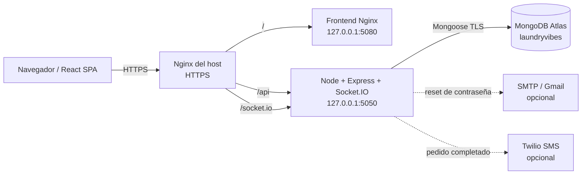

# LaundryVibes

Plataforma web para administrar pedidos de lavandería, clientes, personal operativo e inventario. El proyecto combina una SPA en React, una API Express con MongoDB, autenticación JWT, control de acceso por roles y actualizaciones de pedidos en tiempo real con Socket.IO.

> Producción: [https://laundryvibes.rovicrm.com](https://laundryvibes.rovicrm.com)
>
> Esta página funciona como README y wiki principal del proyecto. Documenta el comportamiento observado en el código; también distingue las funciones completas de las vistas que todavía son prototipos.

## Índice

- [Estado del producto](#estado-del-producto)
- [Arquitectura](#arquitectura)
- [Tecnologías](#tecnologías)
- [Roles y permisos](#roles-y-permisos)
- [Módulos funcionales](#módulos-funcionales)
- [Rutas del frontend](#rutas-del-frontend)
- [Identidad visual SEO y GEO](#identidad-visual-seo-y-geo)
- [API REST](#api-rest)
- [Tiempo real con SocketIO](#tiempo-real-con-socketio)
- [Modelo de datos](#modelo-de-datos)
- [Seguridad](#seguridad)
- [Estructura del repositorio](#estructura-del-repositorio)
- [Configuración](#configuración)
- [Desarrollo local](#desarrollo-local)
- [Pruebas y calidad](#pruebas-y-calidad)
- [Despliegue en producción](#despliegue-en-producción)
- [Nginx DNS y HTTPS](#nginx-dns-y-https)
- [Operación y monitoreo](#operación-y-monitoreo)
- [Backup restauración y rollback](#backup-restauración-y-rollback)
- [Servidor MCP opcional](#servidor-mcp-opcional)
- [Limitaciones conocidas](#limitaciones-conocidas)
- [Roadmap recomendado](#roadmap-recomendado)
- [Guía de contribución](#guía-de-contribución)

## Estado del producto

### Funcional y conectado de extremo a extremo

- Landing pública en español con funciones, perfiles, flujo operativo, beneficios y estado real del producto.
- Identidad visual propia de LaundryVibes en favicon, landing, accesos y paneles.
- SEO técnico con canonical, Open Graph, Twitter Cards, sitemap, robots y datos estructurados.
- GEO con `llms.txt` y una descripción citable que separa capacidades disponibles de la hoja de ruta.
- Acceso compartido para clientes, trabajadores y administradores desde la landing y el selector de perfiles.
- Registro e inicio de sesión de clientes.
- Autenticación JWT Bearer y autorización por roles en el servidor.
- Consulta y edición del perfil del cliente.
- Cambio y recuperación de contraseña.
- Creación e historial de pedidos propios.
- Creación de reclamaciones.
- Panel operacional para trabajadores y administradores.
- Consulta global y finalización de pedidos.
- Avisos de actualización mediante Socket.IO autenticado.
- Inventario con existencias, consumo, reposición, alertas y analítica.
- Notificación SMS opcional al completar un pedido.
- Healthchecks de proceso, MongoDB y frontend.
- Despliegue aislado con Docker Compose y MongoDB Atlas.
- Proxy público HTTPS mediante Nginx.

### Parcial o pendiente

- Admin utiliza el login compartido, entra a `/admin/dashboard` y dispone de una sección protegida para crear accesos de trabajador.
- Worker y admin comparten pedidos e inventario; sólo admin puede crear cuentas operativas. Todavía no existe gestión completa para listar, editar o desactivar usuarios.
- El primer administrador no se crea mediante una ruta pública ni un seeder versionado.
- Daily Rush es una pantalla informativa sin lógica de negocio.
- Los pagos son registros manuales tipo POS; LaundryVibes no procesa dinero. Efectivo, transferencia y tarjeta se configuran por administración, con evidencia para transferencia/tarjeta.
- Los modales de nuevo pedido y generación de reporte del panel operativo siguen siendo maquetas: sus acciones finales no guardan ni descargan datos.
- La navegación a inventario, configuración y administración ya funciona; la ordenación de pedidos y la descarga/envío real de reportes siguen pendientes.
- Las reclamaciones se crean, pero no hay bandeja ni flujo de resolución.
- SMTP y Twilio son opcionales; sin sus variables, correo y SMS permanecen deshabilitados.

## Arquitectura



### Flujo de una solicitud

1. El navegador carga la SPA desde el mismo dominio público.
2. Axios llama rutas relativas bajo `/api`.
3. Nginx dirige `/api/` y `/socket.io/` al backend; el resto va al frontend.
4. Las rutas protegidas validan el JWT y el rol en Express.
5. Mongoose lee o escribe en la base `laundryvibes`.
6. Los cambios de pedidos emiten `orders:refresh`; los clientes vuelven a consultar la API.

### Arranque del backend

1. `config/env.js` carga y valida la configuración.
2. Mongoose se conecta a MongoDB.
3. Se crea la aplicación Express.
4. Express y Socket.IO se adjuntan al mismo servidor HTTP.
5. El proceso empieza a escuchar sólo después de conectar con MongoDB.
6. `SIGINT` y `SIGTERM` cierran Socket.IO, HTTP y Mongoose de forma ordenada.

## Tecnologías

### Frontend

- React 18.3
- Vite 6
- React Router 7
- Axios
- Socket.IO Client
- Tailwind CSS 3
- styled-components
- Lucide, Heroicons y React Icons
- React Toastify
- date-fns

### Backend

- Node.js 20+; las imágenes Docker usan Node 22 Alpine
- Express 4
- MongoDB y Mongoose 8
- JSON Web Tokens
- bcryptjs
- Socket.IO
- Helmet y CORS
- express-rate-limit
- Nodemailer
- Twilio

### Infraestructura

- Docker y Docker Compose
- MongoDB Atlas en la topología recomendada
- Nginx del host como reverse proxy
- Certbot / Let's Encrypt para TLS
- Servidor MCP opcional mediante stdio

## Roles y permisos

| Función | `user` | `worker` | `admin` |
|---|:---:|:---:|:---:|
| Registro público | Sí | No | No |
| Login | Sí | Sí | Sí |
| Consultar/editar perfil propio | Sí | No | No |
| Crear y consultar pedidos propios | Sí | No | No |
| Crear reclamaciones | Sí | No | No |
| Ver todos los pedidos | No | Sí | Sí |
| Completar pedidos | No | Sí | Sí |
| Consultar y operar inventario | No | Sí | Sí |
| Crear trabajadores | No | No | Sí |
| Configuración de sesión y cierre de sesión | Sí | Sí | Sí |
| Alta de trabajadores desde la interfaz | No | No | Sí |
| Gestión completa de usuarios | No | No | Pendiente |

Los guards del frontend mejoran la navegación, pero no son una frontera de seguridad. La autorización real está en el backend mediante `authenticateUser` y `requireRoles(...)`.

## Módulos funcionales

### 1. Autenticación

- Registro de clientes.
- Login común para cuentas de las colecciones `users` y `workers`.
- Contraseñas con bcrypt.
- JWT con ID, rol, asunto y expiración.
- Solicitud de recuperación con respuesta anti-enumeración.
- Tokens de recuperación aleatorios; sólo se guarda su digest SHA-256.
- Restablecimiento y cambio de contraseña.

### 2. Perfil del cliente

El cliente puede consultar:

- Nombre y correo.
- Teléfono.
- Edificio y habitación.
- Número de bolsa.
- Dirección.

Puede modificar teléfono, habitación, bolsa, edificio y dirección. El nombre, correo y rol no se editan desde esta ruta.

### 3. Pedidos

#### Cliente

- Crea un pedido con cantidad de prendas y peso.
- El backend toma el propietario del JWT, no del body.
- Consulta únicamente su historial.
- Ve totales y estados.

#### Operación

- Worker y admin consultan todos los pedidos con información del cliente.
- Pueden marcar un pedido como `Completed`.
- El servidor emite una actualización Socket.IO.
- Si Twilio está configurado, intenta avisar al teléfono almacenado del propietario.

Estados definidos en el modelo:

- `Pending`
- `In Progress`
- `Completed`
- `Delivered`

Actualmente la API operacional sólo implementa la transición directa a `Completed`.

### 4. Reclamaciones

El cliente elige un tipo y agrega una descripción. El backend completa internamente:

- ID del usuario.
- Número de bolsa.
- Nombre.
- Edificio y habitación.
- Fecha de creación.

Tipos admitidos por el modelo:

- `Service Quality`
- `Delay`
- `Damage Items`
- `Communication`

No existe todavía una bandeja de gestión o resolución de reclamaciones.

### 5. Inventario

Incluye:

- Resumen de artículos y existencias.
- Niveles de reposición.
- Registro de consumo.
- Registro de reabastecimiento.
- Consumo promedio diario.
- Fecha estimada de agotamiento.
- Estados `Low`, `Medium` y `High`.
- Alertas `warning` y `critical`.
- Analítica e historial.

Artículos iniciales definidos por el backend:

- Detergent
- Fabric Softener
- Soap
- Bleach
- Starch

La primera lectura de inventario crea estos artículos si la colección está vacía.

### 6. Tiempo real

Socket.IO no transporta pedidos completos. Emite una señal `orders:refresh` para que las pantallas autorizadas vuelvan a consultar la API.

### 7. Integraciones opcionales

- **Correo:** envío del enlace de restablecimiento por Nodemailer/Gmail.
- **Twilio:** SMS al completar un pedido.
- **MCP:** herramientas `login` y `submit_order` para clientes compatibles con Model Context Protocol.

## Rutas del frontend

### Públicas

| Ruta | Vista |
|---|---|
| `/` | Landing pública |
| `/access` | Selector de perfiles |
| `/login` | Inicio de sesión |
| `/registration` | Registro de cliente |
| `/forgot-password` | Solicitud de recuperación |
| `/reset-password/:token` | Restablecimiento |

### Cliente (`user`)

| Ruta | Vista |
|---|---|
| `/user/userdashboard` | Dashboard |
| `/user/order-history` | Historial |
| `/user/submit-order` | Nuevo pedido |
| `/user/submit-order/success` | Confirmación |
| `/user/daily-rush` | Daily Rush, pendiente |
| `/user/profile` | Perfil y seguridad |
| `/user/complaint` | Reclamación |
| `/user/complaint/success` | Confirmación de reclamación |

### Operación (`worker` o `admin`)

| Ruta | Vista |
|---|---|
| `/workerdashboard` | Dashboard operacional |
| `/worker/settings` | Cuenta y permisos del trabajador |
| `/admin/dashboard` | Dashboard con identidad administrativa |
| `/admin/settings` | Cuenta, permisos y alta de trabajadores |
| `/worker/orders` | Gestión de pedidos |
| `/stock` | Inventario |

La SPA incluye una vista comodín 404 y Nginx devuelve HTTP 404 para rutas desconocidas. Las rutas administrativas exclusivas se limitan al panel identificado y al alta de trabajadores; la gestión completa de cuentas sigue pendiente.

## Identidad visual SEO y GEO

La interfaz usa un componente de marca compartido y un símbolo original de LaundryVibes; no depende del antiguo recurso genérico con marca de agua. Los assets públicos incluyen favicon SVG/ICO/PNG, Apple Touch Icon, iconos PWA y una tarjeta social de 1200 × 630 px.

La portada define:

- Título y descripción orientados a software de gestión para lavanderías.
- Canonical absoluto e idioma `es-MX`.
- Open Graph y Twitter Cards con imagen propia.
- JSON-LD para `Organization`, `WebSite` y `SoftwareApplication`.
- `site.webmanifest`, `robots.txt` y `sitemap.xml`.
- `llms.txt` con funciones, perfiles, flujo diario, límites y fuentes preferidas para asistentes de IA.

Las rutas de login, registro, recuperación, selector y paneles cambian dinámicamente a `noindex, nofollow, noarchive` y no publican canonical. El sitemap contiene únicamente la landing pública.

La aplicación continúa siendo una SPA renderizada en el cliente. Para maximizar el rastreo de agentes que no ejecutan JavaScript queda recomendado prerenderizar la landing o migrar la página comercial a SSR/SSG.

## API REST

Prefijo público: `/api`.

Autenticación en rutas privadas:

```http
Authorization: Bearer TOKEN_JWT
```

### Salud

| Método | Ruta | Auth | Descripción |
|---|---|---|---|
| GET | `/api/health/live` | Pública | El proceso responde |
| GET | `/api/health/ready` | Pública | Mongoose está conectado |

### Autenticación

| Método | Ruta | Auth | Descripción |
|---|---|---|---|
| POST | `/api/user/signup` | Pública | Registrar cliente |
| POST | `/api/user/login` | Pública | Login común |
| POST | `/api/user/forgot-password` | Pública | Solicitar recuperación |
| POST | `/api/user/reset-password/:token` | Pública | Aplicar nueva contraseña |
| PUT | `/api/user/update-password` | `user` | Cambiar contraseña autenticada |
| POST | `/api/admin/login` | Pública | Alias del login común |
| POST | `/api/worker/login` | Pública | Alias del login común |

### Perfil

| Método | Ruta | Rol | Descripción |
|---|---|---|---|
| GET | `/api/user/profile` | `user` | Consultar perfil propio |
| PATCH | `/api/user/profile` | `user` | Editar campos permitidos |

### Pedidos

| Método | Ruta | Rol | Descripción |
|---|---|---|---|
| POST | `/api/user/submit-order` | `user` | Crear pedido y declaración de pago (`multipart/form-data`) |
| GET | `/api/user/order-history` | `user` | Consultar historial propio con snapshot financiero |
| GET | `/api/worker/getallorderdetails` | `worker`, `admin` | Consultar todos los pedidos y estados de pago |
| PATCH | `/api/worker/update-order-status/:orderId` | `worker`, `admin` | Marcar pedido como completado |
| PATCH | `/api/worker/orders/:orderId/payment` | `worker`, `admin` | Registrar pago manual POS (`multipart/form-data`) |

Campos para crear pedido:

```text
numberOfClothes=8
weight=3.5
paymentMethod=cash|transfer|card
evidence=<JPG|PNG|WebP|PDF, máximo 2 MiB; obligatorio para transfer/card>
```

El backend calcula y conserva `pricePerKg`, `currency` y `total`; ignora cualquier total enviado por el navegador.

### Pagos y moneda

| Método | Ruta | Rol | Descripción |
|---|---|---|---|
| GET | `/api/payments/config` | `user`, `worker`, `admin` | Configuración efectiva y métodos activos |
| PUT | `/api/admin/payment-config` | `admin` | Editar tarifa MXN y activar/desactivar métodos manuales |
| GET | `/api/payments/orders/:orderId/evidence` | Propietario, `worker`, `admin` | Consultar evidencia protegida; acepta `?source=client|pos` |

LaundryVibes registra pagos manuales, pero no mueve dinero ni almacena PAN, CVV o vencimiento de tarjetas. PayPal, Mercado Pago y Stripe son indicadores no accionables de funciones futuras.

### Reclamaciones

| Método | Ruta | Rol | Descripción |
|---|---|---|---|
| POST | `/api/user/submit-complaint` | `user` | Crear reclamación |

### Trabajadores

| Método | Ruta | Rol | Descripción |
|---|---|---|---|
| POST | `/api/admin/add-worker` | `admin` | Crear trabajador |
| POST | `/api/worker/add-worker` | `admin` | Alias heredado del mismo router |

### Inventario

Todas las rutas requieren `worker` o `admin`.

| Método | Ruta | Descripción |
|---|---|---|
| GET | `/api/stock/all` | Listar o inicializar inventario |
| GET | `/api/stock/analytics` | Obtener métricas agregadas |
| GET | `/api/stock/consumption-history` | Historial; acepta `startDate` y `endDate` |
| GET | `/api/stock/alerts` | Alertas de todos los artículos |
| GET | `/api/stock/:id` | Consultar artículo |
| POST | `/api/stock/create` | Crear artículo |
| POST | `/api/stock/:id/add` | Reabastecer |
| POST | `/api/stock/:id/consume` | Registrar consumo |
| PUT | `/api/stock/:id/update` | Editar nivel/notas |
| DELETE | `/api/stock/:id/delete` | Eliminar artículo |

## Tiempo real con SocketIO

### Handshake

```js
import { io } from 'socket.io-client';

const socket = io({
  auth: { token: '<JWT>' },
});
```

### Salas

- Worker y admin: `workers`.
- Cliente: `user:<userId>`.

### Evento

| Evento | Receptor | Causa |
|---|---|---|
| `orders:refresh` | Sala `workers` | Nuevo pedido |
| `orders:refresh` | Sala `workers` y propietario | Pedido completado |

Los eventos de negocio sólo salen del servidor. No hay comandos de escritura enviados por el cliente a través del socket.

## Modelo de datos

### User — colección `users`

| Campo | Tipo | Notas |
|---|---|---|
| `name` | String | Requerido |
| `email` | String | Requerido, único |
| `phoneNumber` | String | Requerido, único |
| `buildingName` | String | Requerido |
| `roomNumber` | String | Requerido |
| `bagNumber` | String | Requerido |
| `password` | String | Hash, `select:false` |
| `role` | String | `user`, `worker` o `admin`; default `user` |
| `address` | String | Opcional |
| `resetPasswordToken` | String | Digest, `select:false` |
| `resetPasswordExpires` | Date | `select:false` |
| `createdAt`, `updatedAt` | Date | Timestamps |

### Worker — colección `workers`

| Campo | Tipo | Notas |
|---|---|---|
| `email` | String | Requerido, único |
| `password` | String | Hash, `select:false` |
| `role` | String | Default `worker` |

Las cuentas admin bootstrap también viven en esta colección con `role: "admin"`.

### Order — colección `orders`

| Campo | Tipo | Notas |
|---|---|---|
| `userId` | ObjectId | Referencia a User |
| `numberOfClothes` | Number | Mínimo 1 |
| `weight` | Number | No negativo en esquema; la API exige mayor que 0 |
| `createdAt` | Date | Fecha de alta |
| `status` | String | Estado del pedido |
| `smsSent` | Boolean | Evita reenvíos intencionales |

### Complaint — colección `complaints`

| Campo | Tipo | Notas |
|---|---|---|
| `userId` | ObjectId | Propietario |
| `bagNumber` | Number | Número de bolsa |
| `date` | Date | Fecha de alta |
| `typeOfComplaint` | String | Enum de tipos |
| `description` | String | Requerido |
| `userName` | String | Snapshot del nombre |
| `userAddress` | String | Snapshot de edificio/habitación |

### Stock — colección Mongoose `stocks`

| Campo | Tipo | Notas |
|---|---|---|
| `itemName` | String | Enum de productos |
| `currentQuantity` | Number | Existencia actual |
| `unit` | String | Liters, Kg o Pieces |
| `reorderLevel` | Number | Umbral |
| `lastRestockDate` | Date | Última reposición |
| `lastRestockQuantity` | Number | Cantidad repuesta |
| `consumptionHistory` | Array | Fecha, cantidad y motivo |
| `averageDailyConsumption` | Number | Calculado al guardar |
| `estimatedDepletionDate` | Date | Calculado al guardar |
| `status` | String | Low, Medium o High |
| `alerts` | Array | Severidad y resolución |
| `notes` | String | Notas operativas |
| `createdAt`, `updatedAt` | Date | Timestamps |

## Seguridad

### Controles implementados

- JWT con expiración y RBAC en servidor.
- Contraseñas con bcrypt.
- Helmet y eliminación de `X-Powered-By`.
- Allowlist CORS explícita.
- Límite configurable del body JSON.
- Rate limiting en login principal y solicitud de recuperación.
- Respuestas genéricas para evitar enumerar cuentas.
- Tokens de recuperación aleatorios y almacenados sólo como digest.
- Campos sensibles excluidos por defecto en Mongoose.
- Socket.IO autenticado con JWT.
- IDs de propietario tomados del token, no del cliente.
- SMS con teléfono almacenado y texto definido por servidor.
- Errores 500 sin detalles internos en la respuesta.
- Backend Docker como usuario no root.
- Filesystem de aplicaciones en sólo lectura y `no-new-privileges`.
- Límites de CPU, memoria y PIDs.
- Puertos de aplicación enlazados sólo a loopback.
- Base Atlas dedicada y allowlist de IP.
- Secretos fuera de Git con permisos privados.

### Fronteras de confianza

- `localStorage` no es una autoridad de seguridad; sólo controla navegación visual.
- Todo endpoint privado debe conservar middleware de auth y roles.
- Nunca aceptar `userId`, rol, teléfono SMS, texto SMS o estado privilegiado del cliente cuando el servidor puede derivarlos.
- No publicar `secrets/production.env`, JWT, URI Atlas, tokens o credenciales iniciales.

### Riesgos técnicos que deben priorizarse

1. `/api/admin/login` y `/api/worker/login` usan el login común pero no heredan el rate limiter de `/api/user/login`.
2. Las actualizaciones de inventario usan lectura-modificación-escritura y no son atómicas ante concurrencia.
3. La creación de workers no normaliza email ni exige la misma política de contraseña que los usuarios.
4. Los JWT no tienen revocación ni versionado de sesión.
5. El rol del token no se reconsulta en cada petición.
6. `GET /api/stock/all` puede escribir datos al inicializar la colección.
7. No existe una máquina de transiciones para todos los estados de pedido.
8. El inventario necesita validación numérica centralizada y límites explícitos.

## Estructura del repositorio

```text
laundry_buddy/
├── BACKEND/
│   ├── config/                  # Entorno y conexión Mongo
│   ├── controllers/             # Casos de uso por rol/dominio
│   ├── middleware/              # Auth, RBAC y errores
│   ├── models/                  # User, Worker, Order, Complaint, Stock
│   ├── routes/                  # Rutas Express
│   ├── test/                    # Pruebas node:test
│   ├── app.js                   # Composición Express
│   ├── server.js                # Arranque y graceful shutdown
│   ├── socket.js                # Socket.IO autenticado
│   ├── Dockerfile
│   └── package.json
├── Frontend/
│   ├── src/
│   │   ├── Component/
│   │   │   ├── Brand/           # Logo reutilizable
│   │   │   ├── Landing/         # Página pública
│   │   │   ├── SEO/             # Metadatos por ruta
│   │   │   ├── User/            # Portal cliente
│   │   │   ├── Worker/          # Operación e inventario
│   │   │   └── ProtectedRoute.jsx
│   │   ├── Context/             # OrderContext
│   │   ├── App.jsx              # Router
│   │   └── main.jsx             # Bootstrap y Axios
│   ├── public/                   # Favicon, marca, manifest, sitemap y llms.txt
│   ├── Dockerfile
│   ├── docker-nginx.conf
│   ├── vite.config.js
│   └── package.json
├── deploy/
│   ├── mongo-init/              # Usuario Mongo local
│   ├── nginx/                   # Vhost inicial del dominio
│   ├── configure-production-secrets.sh
│   └── *.env.example
├── docs/
│   └── production-runbook.md
├── mcp-serve/                   # Servidor MCP opcional
├── compose.production.atlas.yml # Producción recomendada
├── compose.production.yml       # Alternativa Mongo local
└── README.md                    # Wiki principal
```

Los directorios `node_modules`, `dist`, `secrets`, archivos `.env` y logs están ignorados.

## Configuración

### Variables obligatorias del backend

| Variable | Propósito |
|---|---|
| `MONGODB_URL` | URI de MongoDB |
| `JWT_SECRET` | Firma de JWT; mínimo 32 caracteres en producción |
| `FRONTEND_URL` | URL absoluta del frontend |

### Variables generales

| Variable | Default | Propósito |
|---|---|---|
| `NODE_ENV` | `development` | Modo de ejecución |
| `HOST` | `127.0.0.1` | Interfaz de escucha |
| `PORT` | `3000` | Puerto backend |
| `CORS_ORIGINS` | Origen de `FRONTEND_URL` | Lista separada por comas |
| `PAYLOAD_LIMIT` | `100kb` | Límite JSON |
| `JWT_EXPIRES_IN` | `1h` | Vigencia JWT |
| `RESET_TOKEN_TTL_MINUTES` | `15` | Vigencia del reset |

### Integraciones opcionales

| Variable | Integración |
|---|---|
| `EMAIL_USER` | SMTP/Gmail |
| `EMAIL_PASSWORD` | SMTP/Gmail |
| `TWILIO_ACCOUNT_SID` | Twilio |
| `TWILIO_AUTH_TOKEN` | Twilio |
| `TWILIO_PHONE_NUMBER` | Remitente SMS |

### Mongo local con Compose

- `MONGO_ROOT_USERNAME`
- `MONGO_ROOT_PASSWORD`
- `MONGO_APP_USERNAME`
- `MONGO_APP_PASSWORD`

### Frontend de desarrollo

- `VITE_DEV_PROXY_TARGET`: backend al que Vite reenvía `/api` y `/socket.io`; default `http://127.0.0.1:3000`.

### MCP

- `LAUNDRY_API_BASE_URL`: URL absoluta incluyendo `/api`; default `http://127.0.0.1:3000/api`.

### Ejemplo local

```sh
cp BACKEND/.env.example BACKEND/.env
```

Nunca reutilices valores de ejemplo en producción.

## Desarrollo local

### Requisitos

- Node.js 20 o posterior.
- npm.
- MongoDB accesible.

### Backend

```sh
cd BACKEND
cp .env.example .env
npm ci
npm run dev
```

El backend queda, por defecto, en `http://127.0.0.1:3000`.

### Frontend

En otra terminal:

```sh
cd Frontend
npm ci
npm run dev
```

Vite suele usar `http://localhost:5173` y reenvía API/WebSocket al backend.

### Comandos disponibles

Backend:

```sh
npm run dev      # nodemon
npm start        # producción
npm test         # node --test
npm run audit    # npm audit high
```

Frontend:

```sh
npm run dev
npm run build
npm run lint
npm run preview
```

## Pruebas y calidad

### Gate recomendado

```sh
(cd BACKEND && npm ci && npm test && npm audit --audit-level=high)
(cd Frontend && npm ci && npm run lint && npm run build && npm audit --audit-level=high)
```

### Cobertura backend actual

Las pruebas existentes verifican:

- Variables obligatorias y fortaleza del JWT en producción.
- Headers de seguridad y CORS.
- JWT/RBAC en rutas operativas.
- Auth de reclamaciones y límite de payload.
- Respuesta JSON 404.
- Exclusión de campos sensibles.
- Respuesta genérica de errores 500.

### Pendiente de cobertura

- Integración real con MongoDB.
- Registro y login con persistencia.
- Socket.IO.
- Correo y Twilio.
- Concurrencia de inventario.
- Todos los flujos de estados.
- Pruebas frontend y E2E automatizadas.
- Restauración y rollback ensayados.
- Rendimiento y carga.

## Despliegue en producción

### Topología recomendada: Atlas

Archivo:

```text
compose.production.atlas.yml
```

Servicios:

- `laundryvibes-backend`
- `laundryvibes-frontend`

Puertos:

| Servicio | Contenedor | Host |
|---|---:|---|
| Backend | 3000 | `127.0.0.1:5050` |
| Frontend | 8080 | `127.0.0.1:5080` |

Preparación de secretos:

```sh
./deploy/configure-production-secrets.sh
```

El asistente:

- Lee la URI Atlas sin mostrarla.
- Exige `mongodb+srv://`.
- Exige la base `/laundryvibes`.
- Genera un JWT aleatorio.
- Escribe `secrets/production.env` con modo 600.

Alternativa manual:

```sh
mkdir -p secrets
cp deploy/production.atlas.env.example secrets/production.env
chmod 600 secrets/production.env
```

Configura en Atlas:

1. Proyecto y clúster dedicados.
2. Usuario con `readWrite` sólo sobre `laundryvibes` cuando sea posible.
3. IP del servidor en Network Access; evita `0.0.0.0/0`.
4. URI con la ruta `/laundryvibes` antes de los parámetros.

Validación y arranque:

```sh
docker compose \
  --env-file secrets/production.env \
  -f compose.production.atlas.yml \
  config --quiet

docker compose \
  --env-file secrets/production.env \
  -f compose.production.atlas.yml \
  up -d --build
```

En hosts con poca memoria, construye backend y frontend secuencialmente.

### Alternativa: MongoDB local

Archivo:

```text
compose.production.yml
```

Agrega:

- `laundryvibes-mongo` con MongoDB 8.
- Volumen `laundryvibes_mongo_data`.
- Red interna sin publicar `27017`.
- Usuario de aplicación `readWrite` creado durante la primera inicialización.

No uses esta topología en un VPS compartido sin revisar memoria, disco, backups y aislamiento. El script de `/docker-entrypoint-initdb.d` sólo corre cuando el volumen está vacío.

## Nginx DNS y HTTPS

Configuración base versionada:

```text
deploy/nginx/laundryvibes.rovicrm.com.conf
```

Enrutamiento:

| Ruta pública | Upstream |
|---|---|
| `/api/` | `127.0.0.1:5050` |
| `/socket.io/` | `127.0.0.1:5050` con WebSocket upgrade |
| `/` | `127.0.0.1:5080` |

Secuencia segura:

1. Crear el registro DNS A.
2. Confirmar que resuelve a la IP correcta.
3. Respaldar `/etc/nginx`.
4. Instalar el vhost HTTP.
5. Ejecutar `nginx -t`.
6. Recargar Nginx sólo si la validación pasa.
7. Probar por hostname.
8. Emitir TLS con Certbot.
9. Verificar redirección HTTP → HTTPS y renovación.

Ejemplo de Certbot:

```sh
sudo certbot --nginx \
  -d laundryvibes.rovicrm.com \
  --redirect
```

## Operación y monitoreo

### Estado de contenedores

```sh
docker compose \
  --env-file secrets/production.env \
  -f compose.production.atlas.yml \
  ps
```

### Healthchecks

```sh
curl --fail http://127.0.0.1:5050/api/health/live
curl --fail http://127.0.0.1:5050/api/health/ready
curl --fail http://127.0.0.1:5080/healthz
curl --fail https://laundryvibes.rovicrm.com/api/health/ready
```

Respuestas esperadas:

```json
{"status":"ok"}
```

```json
{"status":"ready"}
```

### Logs

```sh
docker compose \
  --env-file secrets/production.env \
  -f compose.production.atlas.yml \
  logs --tail=200 backend frontend
```

### Reinicio controlado

```sh
docker compose \
  --env-file secrets/production.env \
  -f compose.production.atlas.yml \
  restart backend frontend
```

### Smoke test mínimo después de un release

- Frontend devuelve HTTP 200.
- `/api/health/ready` devuelve 200.
- Registro y login funcionan.
- Una ruta protegida sin token devuelve 401.
- Roles insuficientes reciben 403.
- Un cliente crea y consulta su pedido.
- Worker/admin ve el pedido y lo completa.
- Socket.IO provoca actualización.
- Los datos sintéticos se eliminan al terminar.
- Nginx y certificado permanecen válidos.
- Los demás servicios del host continúan saludables.

## Backup restauración y rollback

Lee también [`docs/production-runbook.md`](docs/production-runbook.md).

### MongoDB Atlas

La estrategia depende del tier contratado. Define y prueba:

- Snapshots o Point-in-Time Recovery disponibles.
- Retención.
- Cifrado.
- Copia o restauración a un clúster aislado.
- Responsable operativo.
- Smoke tests posteriores.

No confundas este procedimiento con el `mongodump` del contenedor local.

### MongoDB local

El runbook incluye un `mongodump` transmitido desde el contenedor a un archivo externo. Todo backup debe:

- Tener timestamp.
- Guardarse fuera del repositorio.
- Usar permisos restringidos.
- Cifrarse y copiarse fuera del host.
- Tener checksum.
- Respetar una política de retención.
- Probarse mediante restauración aislada.

### Restauración

1. Anunciar mantenimiento.
2. Detener el backend para bloquear nuevas escrituras.
3. Tomar un backup final del estado actual.
4. Verificar archivo y checksum.
5. Restaurar en el destino correcto.
6. Iniciar backend y esperar readiness.
7. Ejecutar smoke tests.
8. Reconciliar pedidos y notificaciones.

### Rollback de aplicación

1. Registrar antes del despliegue el commit y los IDs de imágenes vigentes.
2. Conservar la base/volumen.
3. Retaggear imágenes previas o reconstruir el commit revisado anterior.
4. Levantar Compose sin restaurar datos.
5. Verificar health, login, roles y flujo crítico.

Una falla de aplicación no justifica restaurar automáticamente una base antigua.

## Servidor MCP opcional

Directorio:

```text
mcp-serve/
```

Transporte actual: stdio.

Herramientas:

| Tool | Función |
|---|---|
| `login` | Autentica y devuelve JWT/rol |
| `submit_order` | Crea un pedido autenticado |

Instalación:

```sh
cd mcp-serve
npm ci
LAUNDRY_API_BASE_URL=https://laundryvibes.rovicrm.com/api npm start
```

Ejemplo de cliente MCP:

```json
{
  "mcpServers": {
    "laundry-buddy": {
      "command": "node",
      "args": ["/ruta/absoluta/laundry_buddy/mcp-serve/index.js"],
      "env": {
        "LAUNDRY_API_BASE_URL": "https://laundryvibes.rovicrm.com/api"
      }
    }
  }
}
```

Advertencia: la herramienta `login` devuelve el JWT al cliente MCP y `submit_order` lo recibe como argumento. Usa únicamente clientes confiables y evita registrar credenciales o tokens.

## Limitaciones conocidas

### Producto y UX

- Admin comparte el login operativo, pero cuenta con panel identificado y configuración protegida; la gestión completa de trabajadores sigue pendiente.
- Worker y admin tienen cierre de sesión visible y configuración por rol.
- El logout del cliente todavía conserva algunas claves secundarias de `localStorage`.
- Daily Rush no está implementado.
- PayPal, Mercado Pago y Stripe se muestran como integraciones futuras y no ejecutan cobros.
- El backend calcula y conserva el precio autoritativo en MXN; no hay conversión de moneda, impuestos ni reembolsos.
- La confirmación inmediata usa contexto volátil, pero el pedido persistido puede recuperarse desde el historial.
- No existe un framework de i18n ni selector de idioma; la interfaz y los mensajes visibles están localizados en español, mientras los valores canónicos del API permanecen estables en inglés.
- El bundle no usa lazy loading por ruta.

### Operación

- No hay asignación de pedidos a trabajadores.
- No hay cancelación de pedidos.
- No hay transición a `In Progress` o `Delivered` desde la API actual.
- No hay gestión posterior de reclamaciones.
- Listas e historiales no tienen paginación.
- No existe auditoría de quién cambió un pedido o inventario.
- Analytics de stock filtra parte de los datos en memoria.
- Socket.IO usa memoria local y no tiene adapter Redis para múltiples réplicas.

### Datos y consistencia

- `User.bagNumber` es String y `Complaint.bagNumber` es Number.
- `itemName` no tiene índice único aunque el controlador intenta evitar duplicados.
- Las operaciones de stock no son atómicas.
- `GET /api/stock/all` puede inicializar datos.
- Los resúmenes no tratan `Delivered` como completado.
- Algunas fechas están formateadas con `Asia/Kolkata`.

### Ingeniería

- No hay OpenAPI/Swagger.
- No hay migraciones o gestión explícita de índices.
- No hay refresh tokens, revocación JWT ni MFA.
- No hay observabilidad estructurada, métricas o correlation IDs.
- El frontend no tiene pruebas automatizadas.
- El frontend importa `prop-types` sin declararlo como dependencia directa.
- La auditoría actual del frontend reporta advisories de severidad alta en las dependencias transitivas `brace-expansion` y `picomatch`; deben actualizarse y probarse en un cambio separado.
- ESLint termina sin errores, pero mantiene warnings de imports/variables sin uso, dependencias de hooks y Fast Refresh.
- El archivo `BACKEND/vercel.json` no forma parte de la topología Docker/Socket.IO documentada.

## Roadmap recomendado

### Prioridad 0 — seguridad y consistencia

1. Aplicar rate limiting a todos los endpoints de login o eliminar aliases.
2. Normalizar emails y unificar reglas de contraseña para workers/admin.
3. Crear un bootstrap de administrador auditable, idempotente y fuera de rutas públicas.
4. Validar números de inventario con esquemas y usar operaciones atómicas.
5. Implementar versionado/revocación de sesiones.
6. Corregir el tipo de `bagNumber` en reclamaciones.

### Prioridad 1 — operación completa

1. Máquina de estados `Pending → In Progress → Completed → Delivered`.
2. Asignación de pedidos y bitácora de cambios.
3. Bandeja y resolución de reclamaciones.
4. Administración de usuarios y workers.
5. Paginación, búsqueda, filtros e índices MongoDB.
6. Separar el seed de inventario de una ruta GET.

### Prioridad 2 — producto

1. Integración de pagos autoritativa en backend.
2. Comprobantes y conciliación.
3. Precios y reglas de negocio configurables.
4. Daily Rush real.
5. Reportes descargables.
6. Notificaciones configurables.
7. Español/i18n y mejoras de accesibilidad.

### Prioridad 3 — plataforma

1. OpenAPI.
2. Pruebas frontend, integración y E2E.
3. Logs JSON, métricas, alertas y trazas.
4. CI/CD con imágenes inmutables.
5. Backups Atlas y restauración aislada ensayados.
6. Adapter Socket.IO para escalamiento horizontal si llega a ser necesario.

## Guía de contribución

1. Crea una rama descriptiva desde `main`.
2. No incluyas `.env`, dumps, tokens, contraseñas, `node_modules` o `dist`.
3. Mantén auth y RBAC en el servidor.
4. Agrega pruebas para cada cambio de comportamiento.
5. Ejecuta los gates de backend y frontend.
6. Revisa el diff y busca secretos antes del commit.
7. Documenta variables, rutas o cambios de modelo.
8. En producción, separa release de aplicación y migración de datos.

Checklist antes de publicar:

```sh
git diff --check
git status --short
(cd BACKEND && npm test && npm audit --audit-level=high)
(cd Frontend && npm run lint && npm run build && npm audit --audit-level=high)
```

## Referencias

- [Runbook de producción](docs/production-runbook.md)
- [Compose con Atlas](compose.production.atlas.yml)
- [Compose con Mongo local](compose.production.yml)
- [Ejemplo Nginx](deploy/nginx/laundryvibes.rovicrm.com.conf)
- [Configurador seguro de secretos](deploy/configure-production-secrets.sh)
- [Servidor MCP](mcp-serve/README.md)

---

LaundryVibes se publica de forma aislada: sus contenedores, redes, puertos, secretos y base de datos no deben reutilizar recursos de otros proyectos del mismo host.
